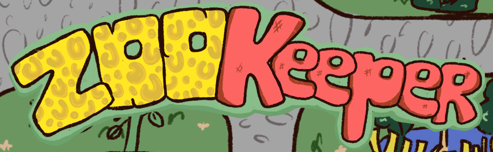
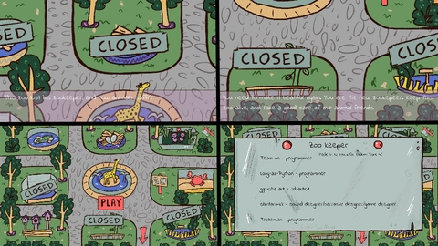
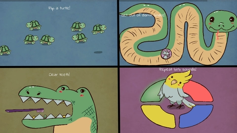
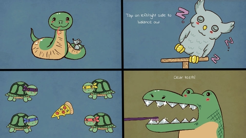
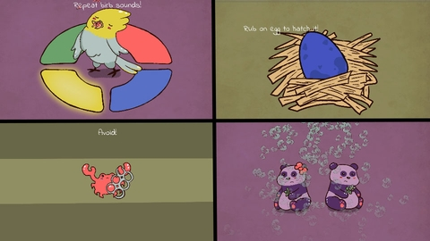

# [Ludum dare 46](https://ldjam.com/)
Theme: Keep it alive  

  
This game is about abondoned Zoo, and you are a new zookepeer.  
You need to entertain, feed and take care of various animals.  
This game contains 8 minigames with 7 difficulty levels.  
All minigames played with click(or taps), it’s easy to get how to play it=)   

# Downloads and Links
Available in [Windows, Linux, OSX and Web](https://teamon.itch.io/zoo-keeper). If you encounter any problem, please leave a issue!  
[Play Market](https://play.google.com/store/apps/details?id=com.Enteryournamestudios.Zookeeper)  
Actually, OSX build have never been tested, so please leave feedback is it work properly.  

# Ludum Dare?
Ludum Dare is one of the world's largest and longest running Game Jam events. Is an event where you create a game from scratch in a weekend based on a theme.  
[Zoo Keeper in Ludum Dare #46](https://ldjam.com/events/ludum-dare/46/$178354)  

# Tools
 * Unity 2019.3.9f1
 * Visual Studio 2019
 * Procreate

# Credits
 * [Team-on](https://github.com/Team-on) - programmer
 * [Long-as-Python](https://github.com/Long-as-Python) - programmer
 * [ggrusha art](https://www.instagram.com/ggrusha_art/) - 2d artist
 * [shintaro-kk](https://www.instagram.com/shintaro_kk) - sound designer/narrative designer/game designer
 * [Trozeman](https://github.com/Trozeman) - programmer

# Screenshots
  
  
  
  
